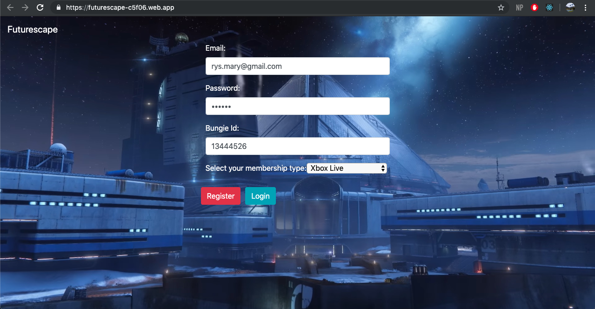
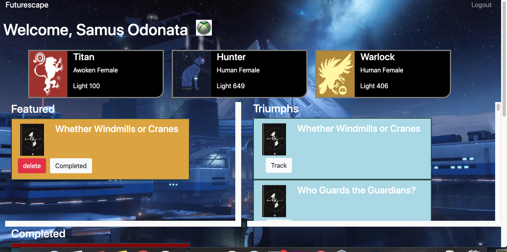

# Futurescape

### Description
Futurescape is an application that utilizes Bungie's Destiny API to display player information and organize Destiny's Triumphs by order of importance to the user. In order to log in, the user must know their Bungie Id. From there they will recognize their (up to 3) playable characters and a list of all triumphs available to complete in destiny. The user can track a "featured" triumph - their ultimate goal they are working towards in game, update the featured, and delete it from their list. Once completed, users can check it off their list.

### Technology Used
* HTML5
* Sass
* Bootstrap 4
* React JS
* Jquery
* Github Version Control
* Destiny API (https://bungie-net.github.io/multi/index.html)
* Google Firebase user auth

### How to run this app
* This page can be accessed at: https://futurescape-c5f06.firebaseapp.com/ 
you will need a bungie account to login (https://www.bungie.net/).

### Screenshot(s)

### Login Screen requires an email, password, and Bungie Id

### User dashboard where 3 in-game characters populate, and the user can select triumphs to track.

### Contributors
* Mary Rys
* Zoe Ames